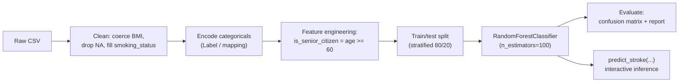

# Stroke Prediction with a Random Forest Classifier

> An end-to-end machine-learning pipeline: EDA → preprocessing → model training → interactive inference: that estimates stroke risk from health and demographic features.


This project walks through a complete supervised-learning workflow on the **Healthcare Stroke** dataset: exploring the data, cleaning and encoding it, engineering a feature, training a `RandomForestClassifier`, evaluating it, and exposing a small `predict_stroke(...)` function for ad‑hoc predictions.

---

## Dataset

`healthcare-dataset-stroke-data.xls` (included): ~5,000 patient records with features such as age, hypertension, heart disease, average glucose level, BMI, smoking status, work/residence type, and the binary `stroke` target.

---

## Pipeline



---

## What's Inside

- **EDA**: correlation heatmap, per-feature KDE plots split by stroke status, distribution histograms
- **Preprocessing**: numeric coercion of `bmi`, missing-value handling, label/ordinal encoding, a `is_senior_citizen` engineered feature
- **Modelling**: stratified train/test split + Random Forest
- **Evaluation**: confusion matrix and `classification_report`
- **Inference**: `predict_stroke(...)` returns a label and a confidence score

---

## Results & an Honest Caveat

The Random Forest reaches high overall accuracy, but the dataset is **heavily imbalanced** (stroke cases are a small minority). High accuracy here is partly driven by the majority "no‑stroke" class, so **recall on the positive (stroke) class is the metric that matters**: read the `classification_report` rather than accuracy alone.

A natural extension is to address the imbalance (class weights, `RandomOverSampler`/SMOTE, or threshold tuning) and compare recall/ROC‑AUC before vs after. See `NOTES.md`.

---

## Getting Started

**Run on Google Colab** (easiest): upload the notebook and the `.xls`, then run all cells.

**Run locally:**
```bash
pip install -r requirements.txt
jupyter notebook Stroke_Prediction.ipynb
```

> If running locally, set the data path to the relative file name `healthcare-dataset-stroke-data.xls` (the notebook currently uses the Colab path `/content/...`).

---

## Project Structure

```
Stroke_Prediction.ipynb                EDA + preprocessing + model + inference
healthcare-dataset-stroke-data.xls     dataset
```

---

## Author

**Muhammad Wajih Hyder** — BS Computer Science, FAST‑NUCES (2026)
[GitHub @wajihhyder](https://github.com/wajihhyder) · wajihhyder22@gmail.com
